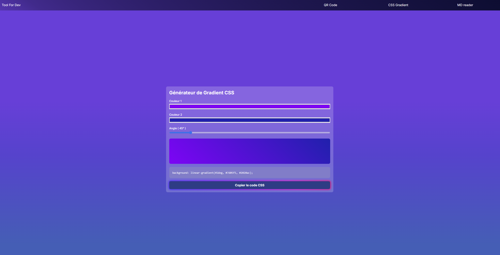
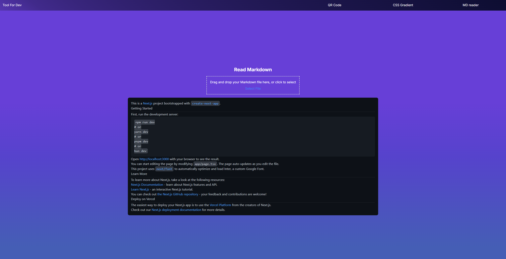
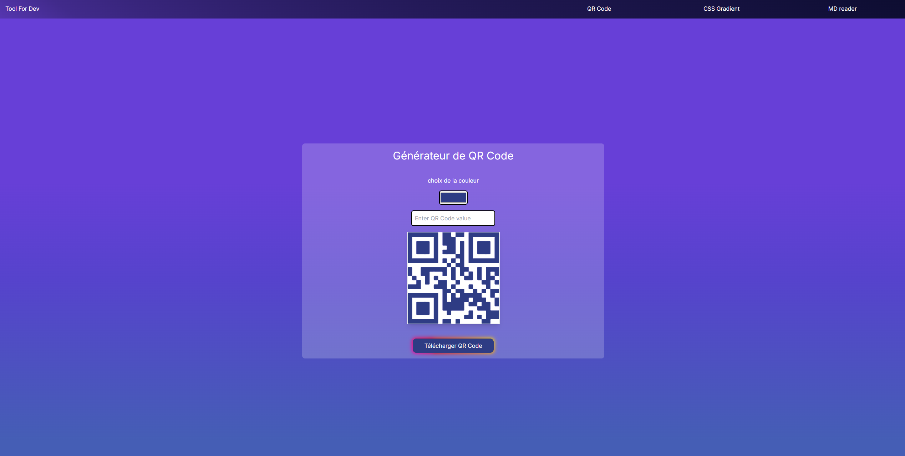

# Tool for Dev

**Tool for Dev** est une application conçue pour simplifier et améliorer le flux de travail des développeurs en offrant un ensemble d'outils utiles dans un seul environnement. Que vous soyez développeur front-end, back-end, ou full-stack, **Tool for Dev** vous propose des fonctionnalités adaptées pour gagner en productivité.

## Installation

Clonez le dépôt et installez les dépendances avec npm ou yarn :

```bash
git clone https://github.com/votre-utilisateur/tool-for-dev.git
cd tool-for-dev
npm install

```

## Démarrage de l'application

Pour démarrer l'application en mode développement, utilisez la commande suivante :

    ```bash
    npm run dev
    ```

L'application sera accessible à l'adresse http://localhost:3000.

## Fonctionnalités

- **[Générateur de dégradés CSS](https://tool-for-dev.netlify.app/css-gradient)** : Créez des dégradés complexes et obtenez le code CSS instantanément.
  
- **[Lecteur Markdown](https://tool-for-dev.netlify.app/md-reader)** : Prévisualisez votre Markdown directement dans l'application.
  
- **[Générateur de QR Codes](https://tool-for-dev.netlify.app/qr-code)** : Créez des QR Codes personnalisés pour vos projets.
  

## Structure du projet

Le projet est structuré comme suit :

```bash
.
├── public/
│   ├── CSS_gradient.png
│   ├── MD_reader.png
│   ├── QR_code.png
│   └── ...
├── src/
│   ├── app/
│   │   ├── css-gradient/
│   │   │   └── page.tsx
│   │   ├── md-reader/
│   │   │   └── page.tsx
│   │   ├── qr-code/
│   │   │   └── page.tsx
│   │   └── ...
│   ├── components/
│   │   ├── Navbar/
│   │   │   └── Navbar.tsx
│   │   └── ...
│   └── ...
├── README.md
├── package.json
├── next.config.js
└── ...
```

## Contribution

Les contributions sont les bienvenues ! Pour contribuer :

- Forkez le projet.
- Créez votre branche de fonctionnalité (git checkout -b feature/AmazingFeature).
- Commitez vos modifications (git commit -m 'Add some AmazingFeature').
- Poussez vers la branche (git push origin feature/AmazingFeature).
- Ouvrez une Pull Request.

## Licence

Distribué sous la licence MIT. Voir LICENSE pour plus d'informations.

## A propos

Ce projet est développé par [Votre Nom] et est conçu pour être un outil polyvalent pour les développeurs.
